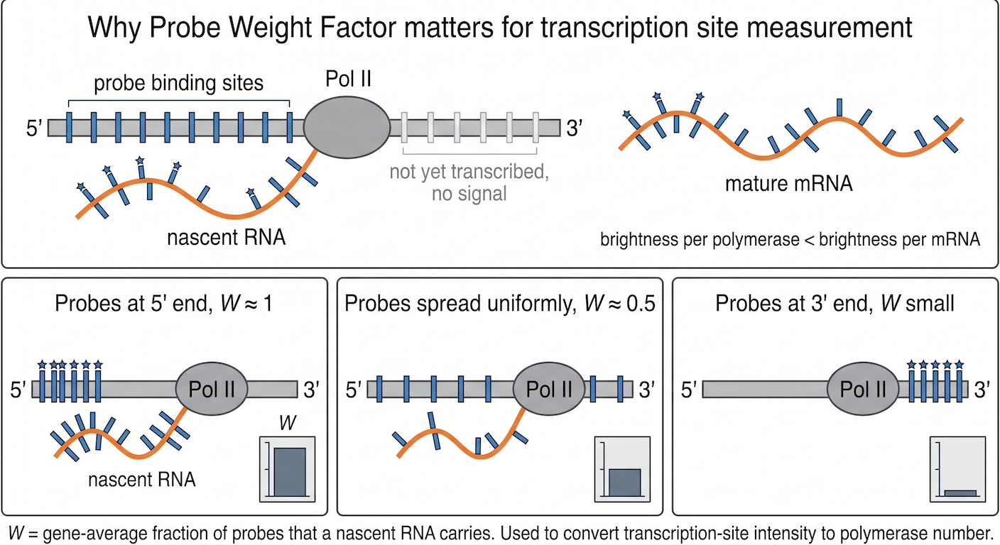

# TransQuant probe weight factor (W)

A browser app and command-line tool that computes the **probe weight factor W**, the **gene length L** and the **probe localisation profile N** for a single-molecule FISH (smFISH) probe set, as defined in the TransQuant methodology:

> Bahar Halpern K, Itzkovitz S. *Single molecule approaches for quantifying transcription and degradation rates in intact mammalian tissues.* Methods 98:134–142 (2016). https://doi.org/10.1016/j.ymeth.2015.11.015

****W**** corrects the brightness of a transcription site for where the probes bind along the gene. A nascent RNA still attached to Pol II only carries the probes that bind *upstream* of the polymerase, so a transcription site is dimmer per polymerase than a mature mRNA. W is the gene-average of that fraction: **W ≈ 1** when probes cluster at the 5' end, **≈ 0.5** when spread uniformly, **small** when they cluster at the 3' end.



Only this correction factor is reimplemented here. Spot detection and counting are left to tools such as [big-fish](https://github.com/fish-quant/big-fish).

**Browser app:** https://jeffleelab.github.io/TransQuant-probe-weight/ — runs entirely in your browser via `stlite`; nothing is uploaded anywhere.

---

## 1. Using the browser app

### Step 1 — get the target gene sequence

You need the **full genomic locus**, from transcription start to transcription end, **including all introns, exons and UTRs**. Do **NOT** use the spliced mRNA or cDNA.

The sequence must read **in the direction of transcription** (5' → 3' along the RNA, i.e. the coding/sense strand). The app does not read strand information from FASTA headers. `N` bases (undetermined regions) are allowed; probes never match across them.

### Step 2 — paste the probe sequences

Paste one probe per line, or paste rows straight from Excel, Google Sheets or the Stellaris probe-designer output. Extra columns (probe number, GC%, position) and a header row are detected and ignored; the app picks the single column in which every row is a DNA sequence. Duplicates are collapsed. `U` is converted to `T`.

Probes are the **antisense** oligos as you ordered them (complementary to the RNA); the app reverse-complements them before searching. If you pasted target-sense sequences by mistake, the app tells you and you can untick *Reverse complement probes*.

### Step 3 — Compute W and read the output

- **W** — the probe weight factor.
- **L** — gene length in bp.
- **Probes matched / supplied**, and the number of **binding sites**. A probe that matches the gene at several places is counted at every site. Such probes, and any probe that was not found, are listed in a warning.
- **Plot** of N(i), the number of probes bound to a nascent RNA whose Pol II has reached position *i*. Download as PNG or SVG.
- A ready-to-paste **methods sentence**.
- **Probe positions** table (start, end, midpoint, number of sites).

### Using W with your smFISH spot counts

$$
\text{Transcription rate (mRNA} \cdot \text{hour}^{-1}\text{)} = \frac{\dfrac{\text{nascent transcript number}}{\text{probe weight factor } W} \times \text{elongation rate}}{\text{gene length } L}
$$

$$
\text{Decay rate (hour}^{-1}\text{)} = \frac{\text{chromosome fraction} \times \text{transcription rate} \times \text{number of chromosome copies}}{\text{transcripts in the cell}}
$$

$$
\text{Half-life (min)} = \frac{\ln(2)}{\text{decay rate}} \times 60
$$

See Eqs. 3–8 of the original publication for the full treatment.

### Interpretation and pitfalls

| Symptom | Likely cause |
|---|---|
| W ≈ 1 − (what you expected) | Target pasted on the wrong strand. Re-download with *Reverse complement*. |
| W ≈ 0.5 for a library you know is 5'-biased | Spliced mRNA pasted instead of the genomic locus. |
| Many probes "not found" | Wrong gene/isoform, wrong species, or probes already target-sense. |
| "No probe matched … match without reverse complementing" | You pasted target-sense sequences: untick *Reverse complement probes*. |

---

## 2. Advanced: run locally or use the CLI

### Install

```bash
git clone https://github.com/JeffLeeLab/TransQuant-probe-weight.git
cd TransQuant-probe-weight
pip install -e .            # CLI only (numpy, matplotlib)
pip install -e ".[app]"     # also Streamlit, for the local app
# or, with mamba/conda:
mamba env create -f environment.yml && mamba activate transquant-w
```

### Command line

```bash
transquant-w --target gene.fa --probes probes.txt --out results/gene --svg
```

```
W	0.5298
L	12345
probes_supplied	48
probes_matched	48
binding_sites	48
```

Options:

| Flag | Meaning |
|---|---|
| `--target FILE` | FASTA or plain text of the full genomic locus, in the direction of transcription. |
| `--probes FILE` | One probe per line, or a delimited table with a sequence column. |
| `--out PREFIX` | Write `PREFIX.png` (plot). Without it, nothing is written. |
| `--svg` | Also write `PREFIX.svg`. |
| `--profile-tsv` | Also write `PREFIX_profile.tsv` with N(i) for every position. |
| `--no-revcomp` | Probes are already target-sense; do not reverse complement them. |
| `--no-concat` | For multi-entry FASTA, use only the first entry. |

Warnings (header rows removed, unmatched probes, multi-site probes, FASTA concatenation) go to stderr; results go to stdout as tab-separated `key value` lines. Exit code 1 on an input error.

### Local Streamlit app

```bash
streamlit run app.py
```

### Python API

```python
from transquant_w import core

target, warnings = core.parse_target(open("gene.fa").read())
probes, more_warnings = core.parse_probes(open("probes.txt").read())
res = core.compute(target, probes, warnings=warnings + more_warnings)
res.W, res.L, res.N, res.hits, res.unmatched, res.multi_site
fig = core.make_plot(res)
```

### Embedding in another Streamlit app

The app UI lives in `transquant_w.ui.render()`, a parameter-less function that draws the whole page body (title, inputs, results) and never calls `st.set_page_config`, `st.navigation`, `st.sidebar`, `st.stop` or touches `st.session_state`. That makes it safe to mount as one page of a host app that uses `st.navigation`, alongside other tools.

```bash
pip install "git+https://github.com/JeffLeeLab/TransQuant-probe-weight.git@<tag>"
```

```python
import streamlit as st
from transquant_w.ui import render
render()
```

The host app owns `st.set_page_config` and the theme (page title/icon, layout, `.streamlit/config.toml` colours); `render()` only draws widgets inside whatever page it's placed on. The standalone `app.py` in this repo is just `st.set_page_config(...)` followed by `transquant_w.ui.render()`.

### How the browser build works

`web/index.html` loads a pinned `@stlite/browser` from jsDelivr and mounts `app.py`, `transquant_w/core.py` and `transquant_w/ui.py`, which are fetched from the same static site. `scripts/build_site.sh` assembles `dist/`; the GitHub Actions workflow runs the tests, builds `dist/` and deploys it to GitHub Pages (Pages source: *GitHub Actions*). To preview locally:

```bash
sh scripts/build_site.sh && python -m http.server -d dist 8000
```

Notes learned the hard way: stlite's `streamlitConfig` accepts only string/number/boolean values (no lists), and a font URL inside `theme.font`/`theme.codeFont` crashes the frontend, so fonts are loaded with `<link>` / `@font-face` in the HTML instead.

### Tests

```bash
pytest
```

Analytic cases (uniform probes → W ≈ 0.5, 5'-clustered → ≈ 1, 3'-clustered → ≈ 0, multi-site counting, parsing edge cases) plus a cross-check against the earlier R translation on a synthetic 12,345 bp locus with 48 probes (`tests/data/`).

---

## Algorithm

For a target of length L and probe binding-site midpoints `mid`:

```
N(i) = number of binding sites with mid < i        for i = 1 … L
W    = (1/L) · Σ N(i) / N(L)
```

Reimplemented from the TransQuant MATLAB functions `compute_correction_factor.m`, `output_UCSC_probe_track.m`, `find_probe_fit.m` and `compute_weight_factor.m` (kept in `archive/` for provenance), with these deliberate differences: exact matching instead of best-fit with mismatches, actual probe length instead of a fixed 20 nt, all matching sites counted, and no strand inference from headers.

## Citation

Please cite the original methodology paper (above). `CITATION.cff` also describes this repository.


